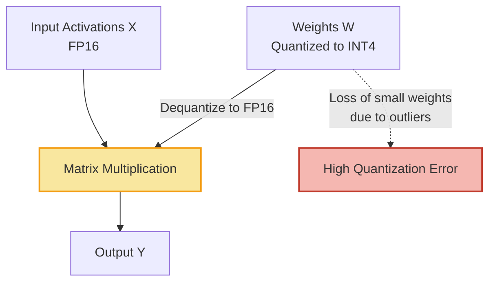
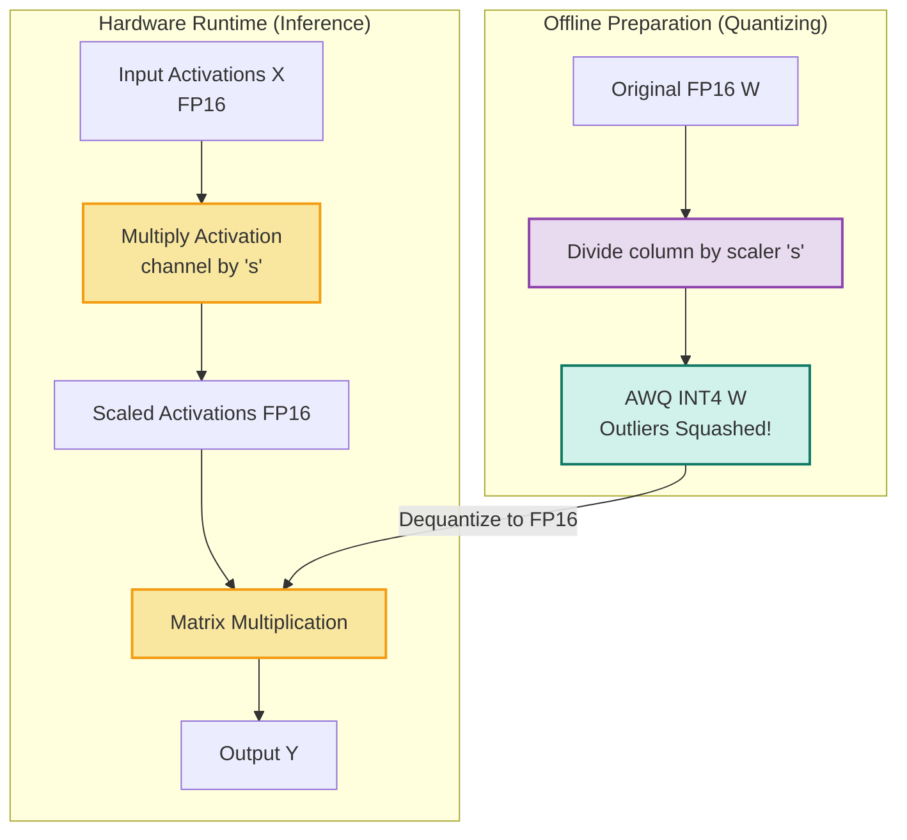

# An Intuitive Guide to Quantization & AWQ

> **Target Audience:** Master's students in Computer Science  
> **Goal:** Build a conceptual, visual framework for how Quantization and AWQ work, sidestepping heavy matrix calculus.

---

## 1. The "Low-Color GIF" Analogy: What is Quantization?

Imagine you have a stunning, high-resolution photo of a sunset captured in **32-bit True Color** (millions of colors). It looks perfectly smooth, but the file size is 10 MB. 

You need to send this to a friend on a slow connection, so you compress it into an **8-bit GIF** (only 256 colors). 
- The image still clearly looks like a sunset. 
- You saved 75% of the file size.
- But if you zoom in, the smooth gradients of the sky now look banded, like a staircase.

**Neural Network Quantization is exactly this, but for numbers.**
Instead of pixel colors, we are compressing **weights** (the "memories" and "knowledge" of the LLM).
- **FP16 (16-bit)** is the True Color photo. Lots of decimal precision. (e.g., `3.14159`)
- **INT4 (4-bit)** is the heavily compressed GIF. There are only **16 possible values** you can choose from. (e.g., you must choose between `3.0` and `3.5`).

> **The Tradeoff:** The model becomes 3x-4x smaller and faster to run, but loses some "smoothness" in its logic (Quantization Error).

---

## 2. The "Classroom Microphone" Analogy: The Outlier Problem

Let's look at how basic **Round-To-Nearest (RTN)** quantization groups weights. Hardware limits usually force us to quantize weights in groups of 128.

Imagine a classroom of 128 students. We need to record them, but we only have **one master volume knob** (the Scale Factor / $\Delta$) for all 128 microphones.

- **Scenario A (Normal):** All 128 students are whispering at Volume 2. We turn the master knob to capture volume 0-3 perfectly. We hear everyone clearly. *This is clean quantization.*
- **Scenario B (The Outlier):** 127 students are whispering at Volume 2. **One student (the outlier) is screaming through a megaphone at Volume 100.** 

To avoid the microphone exploding (integer overflow) from the screamer, we are forced to turn the master volume knob *way down* to accommodate the 100 volume. 

**The Result:** The screaming student is recorded perfectly. But the 127 whispering students are now recorded as `0.0`. Their voices (their weights) are completely erased. *This is catastrophic quantization error.*

In LLMs, it turns out that 1% of the network contains massive outliers. If you use RTN, the 99% of normal weights get zeroed out or heavily degraded. The model instantly becomes "stupid" and generates gibberish.

---

## 3. The "AWQ" Solution: Whisperers get better mics!

**AWQ (Activation-aware Weight Quantization)** solves the screaming student problem without needing expensive "mixed-precision" hardware. It relies on a simple mathematical trick: multiplying by 1.

$$ Y = W \times X $$

This is identical to:

$$ Y = (W / s) \times (X \cdot s) $$

Where $s$ is a scaling factor.

### Back to the Classroom:
AWQ looks at the students and says: *"Hey, Screaming Student. We are going to turn your microphone sensitivity DOWN by a factor of 10 ($s=10$)."*

Now, the screamer's volume enters the mixer as $100 / 10 = 10$.
Because the maximum volume in the room is now only 10, we don't have to turn the master volume knob down nearly as much! 

All the whispering students (weights) are successfully recorded (quantized) with high fidelity into their 16 buckets.

But wait... didn't we just make the screamer sound quiet? 
**The Trick:** As the sound leaves the speakers (the activations $X$), AWQ immediately multiplies the screamer's speaker channel by $10$ ($X \cdot 10$). 

The output $Y$ remains mathematically perfectly identical, but we completely bypassed the bottleneck of the integer conversion process!

---

## 4. Visualizing the Architecture (Mermaid)

Here is a visual representation of how the weights $W$ and the input features (Activations) $X$ interact in a standard FP16 network vs an AWQ network.

### Standard RTN Quantization (Prone to Outlier Error)

### AWQ Quantization (Optimal)

Notice how the scaling happens *before* we bake the model into the hard drive. At runtime, the hardware doesn't do anything special, it just multiplies numbers as usual.

---

## Summary for the CS Student

1. **Why Activation-Aware?** You can't just look at the Weights $W$ to find the "screamer". A weight of $2.0$ isn't dangerous unless it multiplies against an activation $X$ of $50.0$. AWQ runs a small dataset (WikiText) through the model *first* to see which activation channels $X$ get loud. It protects those specific weight columns.
2. **Why not just leave outliers in FP16?** "Mixed precision" (some INT4, some FP16) ruins hardware acceleration. Modern GPUs rely on Tensor Cores that expect massive contiguous blocks of identical data types. AWQ forces the data perfectly into uniform INT4 blocks.
3. **No runtime penalty:** The `Multiply Activation channel by 's'` step in the diagram above is computationally "free" because it is fused mathematically into earlier layers (like LayerNorm) before inference even begins.

👉 **Next Step:** Run the [Jupyter Notebook Demonstration](01_visualize_basics.ipynb) to see the heatmaps and math happen in real-time Python!
